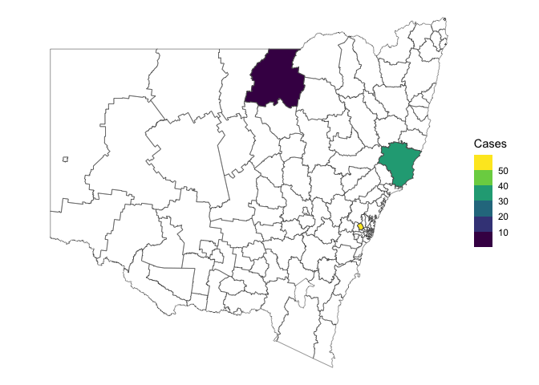

<!-- README.md is generated from README.Rmd. Please edit that file -->

# nswgeo

<!-- badges: start -->

[](https://cidm-ph.r-universe.dev)
[](https://github.com/cidm-ph/nswgeo/actions/workflows/R-CMD-check.yaml)
[](https://CRAN.R-project.org/package=nswgeo)
<!-- badges: end -->

A collection of geospatial datasets and map plotting helpers for working
with New South Wales maps. The maps are registered with `{cartographer}`
and so are compatible with `{ggautomap}`.

## Installation

You can install nswgeo like so:

``` r
# CRAN release
install.packages('nswgeo')

# development version
install.packages('nswgeo', repos = c('https://cidm-ph.r-universe.dev', 'https://cloud.r-project.org'))
```

## Examples

The data can be used directly with ggplot:

``` r
library(nswgeo)
library(ggplot2)

ggplot(nswgeo::lhd) + geom_sf(aes(fill = lhd_name), show.legend = FALSE)
```


Alternatively, the data can be accessed through `{cartographer}`:

``` r
library(cartographer)
head(covid_cases_nsw)
#> # A tibble: 6 × 5
#>   postcode lga       lhd                 year type 
#>   <chr>    <chr>     <chr>              <int> <chr>
#> 1 2427     Mid-Coast Hunter New England  2022 B    
#> 2 2761     Blacktown Western Sydney      2021 A    
#> 3 2426     Mid-Coast Hunter New England  2022 B    
#> 4 2148     Blacktown Western Sydney      2022 B    
#> 5 2768     Blacktown Western Sydney      2021 A    
#> 6 2766     Blacktown Western Sydney      2021 B

covid_cases_nsw |>
  dplyr::count(lga) |>
  add_geometry(lga, feature_type = "nswgeo.lga") |>
  ggplot() +
  geom_sf(aes(fill = n)) +
  geom_sf(fill = NA, data = map_sf("nswgeo.lga")) +
  theme_void()
```


